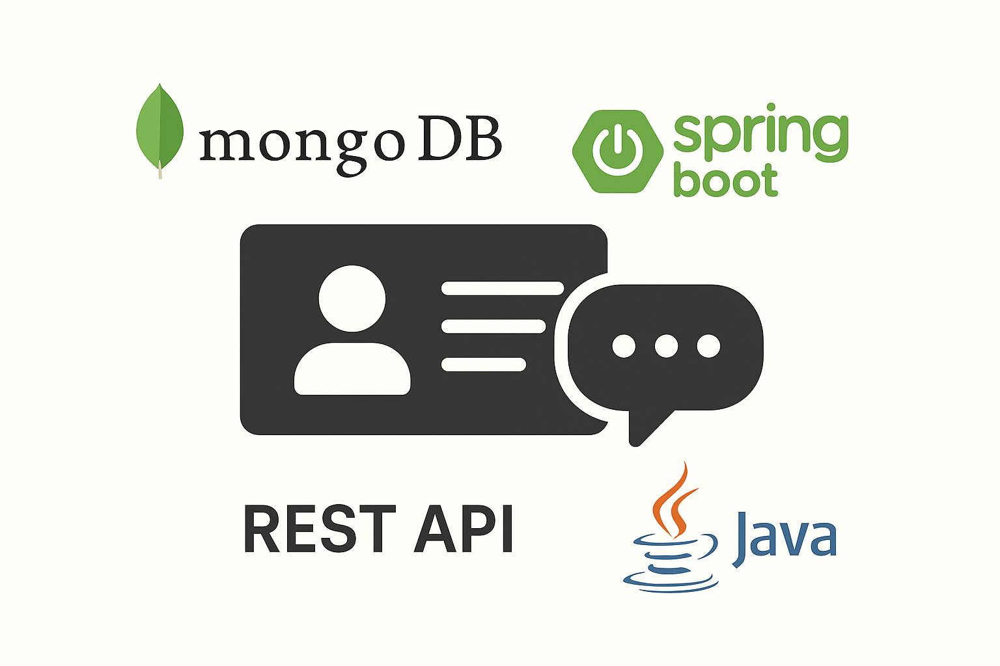
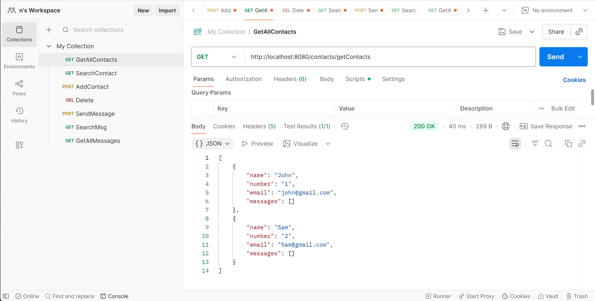
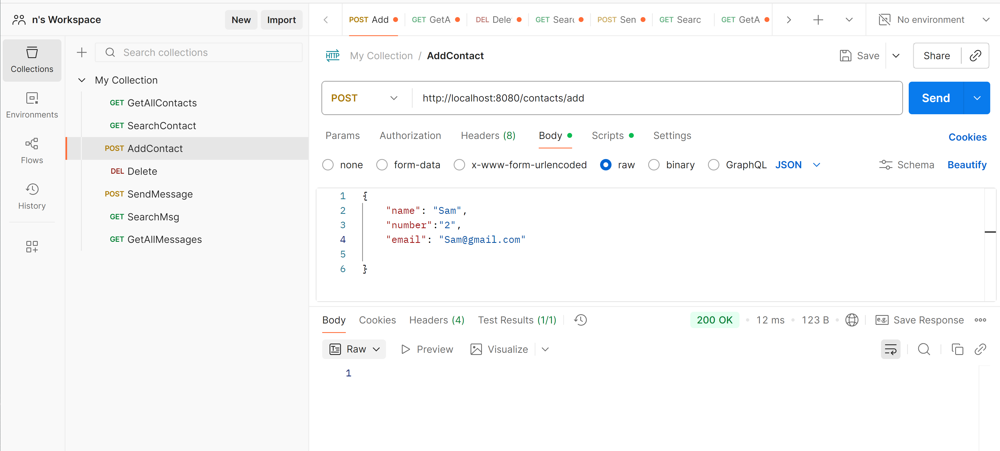
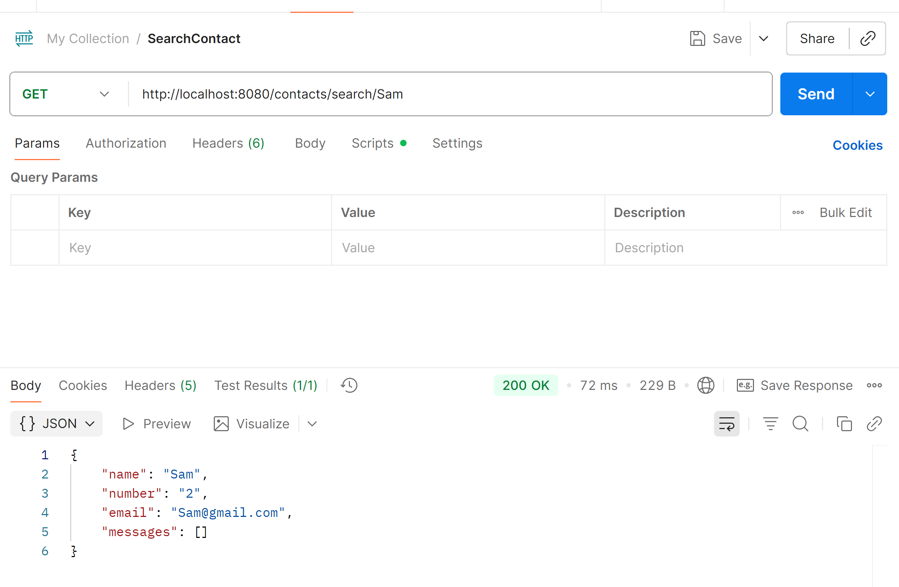

# Clone this Repo if you want to learn REST API, MONGO DB, SpringBoot,and JAVA.

# Getting Started

### About the APP and How to RUN it

This application is an SpringBoot app for people who wanna learn how to create a web app and work with APIs.
It mimics your contact and message services of your phone. Each user has multiple contacts and can send messages to them.
There are multiple APIs defined as below:
Contact related APIS : add contact, search contact, delete contact, view all contacts.
Message related APIs: send message, search message, view al messages.

The app design follows the MVC model: it has the layers Controller -> Service -> Data Access Layer (DAO), and Models (Contact & Message)
It enables you to either store your data to local storage (you can simply change the spring.profile.active to inmem) or you can store data to Mongo DB.
This feature is provided for you to learn how we can leverage MongoRepository features for better performance, easier implementation (the methods to query database are already implemented or generated by spring and you don't need to implement various methods, such as findByName, deleteById,.., and more). 

*** Please note that as of now, Mongo DB feature is enabled for the contact based APIs, and Message APIs only use inMem. You are welcome to add Mongo_repository for message APIs if you're interested.

## To start Mongo DB server:
If you eventually want to persist data, install MongoDB on your machine:

1- Install MongoDB

Download from MongoDB Community Server : https://www.mongodb.com/try/download/community
Windows: run as service.
macOS: brew install mongodb-community 
Linux: Follow your distro’s instructions.

2- in your properties, configure uri and DB name:
spring.data.mongodb.uri=mongodb://localhost:27017/localDB
spring.data.mongodb.database=contactdb

3-Create a folder for Mongo data (if you haven’t already):
Run in your terminal:
mkdir C:\data\db

4- start the server:
In your terminal run this command: (notice the command includes the address where your MongoDB is installed )
By default on Windows, MongoDB installs here:C:\Program Files\MongoDB
Command to run the server:
& "C:\Program Files\MongoDB\Server\8.2\bin\mongod.exe" --dbpath "c:\data\contactdb"

5- Run the springBoot app (on port 8080) and use PostMan to test the APIs

Below are screenshots of postman for some of the API calls with the response:

View all contacts:

Add contact:

Search Contact:

I have provided the collection of APIs for your convenience in the **Postman_API_collection** folder. you need to import it to the postman to use.
If you don't have Mongo on your system, only change Spring.profile.active to inmem in the application.properties file to have the apis tested easily. OTherwise, to use MongoDB, you need to have it installed and then run the mongo server using the command that was explained earlier.